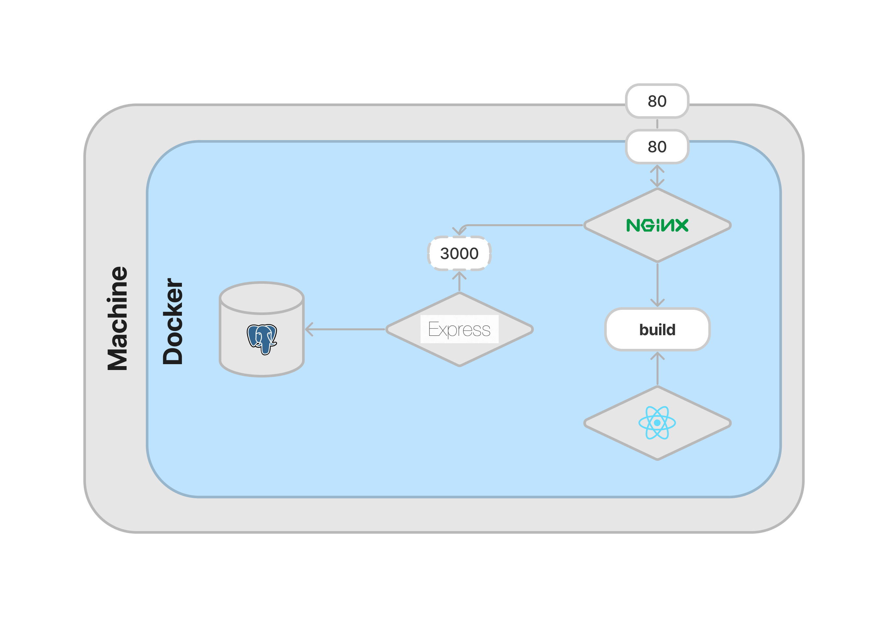

# Todo List

## Overview

A dead simple todo list application with express.js, react and PostgreSQL with Ant Design for demo only.

## Getting Started

These instructions will get you a copy of the project up and running on your local machine for development and testing purposes.

### Project Structure



### Prerequisites

What things you need to install the software and how to install them.

- Docker: You can download it from [the official Docker website](https://www.docker.com/products/docker-desktop).
- Docker Compose: It is included in the Docker Desktop for Windows and macOS. For Linux, you can follow the instructions on [the official Docker website](https://docs.docker.com/compose/install/) to install it.

### Installing

A step by step series of examples that tell you how to get a development environment running.

1. **Clone the repository**: First, you need to get a copy of the code on your local machine. You can do this by cloning the repository. Open a terminal and run the following command:

    ```bash
    git clone https://github.com/username/repository.git
    ```

2. **Navigate to the project directory**: Use the cd command to navigate into the directory that was created when you cloned the repository:

3. **Build the Docker images**: Docker Compose can build all the images for your application with a single command:

    ```bash
    docker-compose build
    ```

4. **Run the Docker containers**: After the images have been built, you can start the containers with the following command:

    ```bash
    docker-compose up
    ```

This should start the application. You can then access it in your web browser at http://localhost.

To stop the application, press Ctrl+C in the terminal. If you want to run the containers in the background, you can use `docker-compose up -d`.
